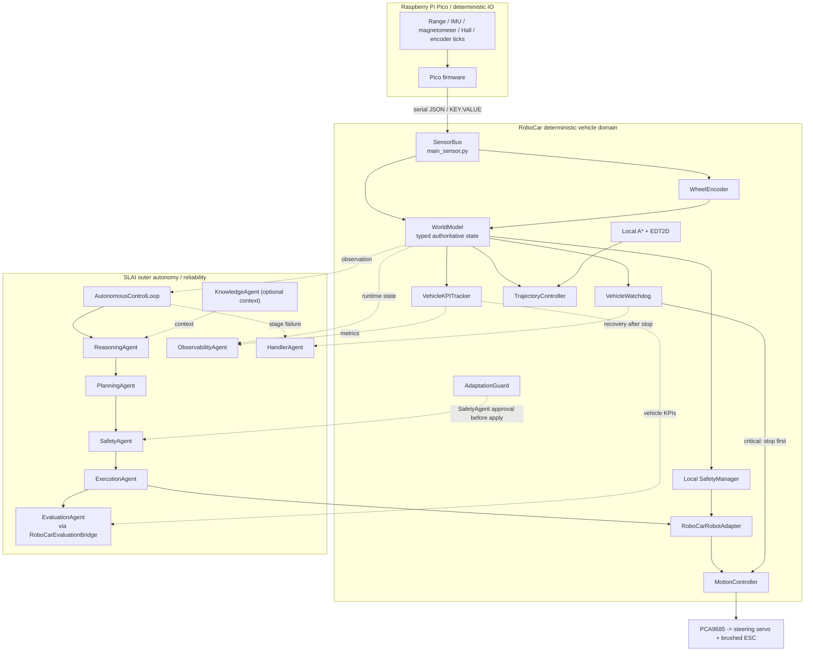

# RoboCar

RoboCar is the vehicle-specific hardware, deterministic control, safety, state-management, and **SLAI integration layer** for an AI-driven Ackermann-steered RC car.

It is designed to run as a nested package inside the parent [SLAI](https://github.com/The-Outsider-97/SLAI) repository. RoboCar is **not** a second general AI runtime: SLAI owns agent construction, reasoning, planning, policy-level safety, execution orchestration, recovery, evaluation, observability, and the outer autonomous lifecycle; RoboCar owns the physical vehicle boundary and the deterministic vehicle-domain contracts that must remain explicit, inspectable, and fail-safe.

The current composition root is:

```text
RoboCar/robocar.py
```

not the former `robo_car.py` path.

---

## 1. Intended deployment layout

```text
SLAI/
├── rc_main.py                         # runtime entry point copied from RoboCar/rc_main.py
├── RoboCar/
│   ├── README.md
│   ├── __init__.py
│   ├── rc_main.py                     # source copy of the SLAI-root launcher
│   ├── robocar.py                     # composition root / SLAI vehicle boundary
│   ├── main_sensor.py                 # Pico serial SensorBus + normalized SensorReading
│   ├── motion_controller.py           # steering/ESC PWM + speed PID
│   ├── wheel_encoder.py               # accumulated ticks -> filtered wheel speed
│   ├── configs/
│   │   └── rc_configs.yaml
│   ├── modules/
│   │   ├── __init__.py
│   │   ├── adaptation_guard.py
│   │   ├── edt2d.py
│   │   ├── kpi_tracker.py
│   │   ├── slai_autonomy.py
│   │   ├── trajectory_control.py
│   │   ├── watchdog.py
│   │   └── world_model.py
│   ├── hardware/
│   │   ├── PCA9685.py
│   │   ├── gnss.py
│   │   ├── mpu6050.py
│   │   ├── nrf24.py
│   │   ├── adafruit_tlv493d.py
│   │   ├── adafruit_vl53l0x.py
│   │   └── ...
│   └── utils/
│       ├── config_loader.py
│       ├── rc_errors.py
│       └── rc_helpers.py
├── src/                               # SLAI agents/runtime
├── logs/
└── ...
```

`modules/__init__.py` deliberately exports only the deterministic RoboCar-domain modules. `modules.slai_autonomy` is imported explicitly by `robocar.py` so deterministic modules remain importable without eagerly pulling in the wider SLAI agent graph.

---

## 2. Runtime architecture



The architecture deliberately separates **mission/policy-scale autonomy** from the **fast deterministic vehicle-control path**. SLAI does not replace the local collision, actuator, freshness, or emergency-stop boundary.

---

## 3. Control-domain ownership

| Domain | Primary owner | Responsibilities |
|---|---|---|
| Physical/hard boundary | RoboCar | serial transport, wheel ticks, PWM, steering, ESC neutral/stop, hardware status |
| Deterministic vehicle domain | RoboCar | typed world state, local safety, trajectory control, KPI accounting, watchdogs, A*, adaptation guardrails |
| Outer autonomy | SLAI | reason -> plan -> authorize -> execute -> evaluate |
| Reliability | SLAI + RoboCar | stop-first local handling, HandlerAgent recovery, degraded-state publication |
| Assessment | RoboCar + SLAI | vehicle KPI semantics locally; general EvaluationAgent assessment through a bridge |
| Telemetry | SLAI ObservabilityAgent | non-authoritative traces, throughput, events, bounded runtime reports |

A hardware emergency stop or watchdog-critical condition must not wait for reasoning, planning, model inference, agent retries, or network communication.

---

## 4. Safety invariants

The current `robocar.py` enforces several composition-level invariants.

### 4.1 Stop first, recover second

Emergency-stop and watchdog-critical paths command the local motion boundary before invoking SLAI recovery logic.

`HandlerAgent` recovery is therefore not the first safety layer. It operates after a local safe-stop attempt and after RoboCar has entered a degraded or emergency state.

### 4.2 One physical ExecutionAgent

The physical SLAI `ExecutionAgent` is created with:

```python
robot=RoboCarRobotAdapter(...)
```

and that same factory-managed instance is reused by `modules/slai_autonomy.py`. RoboCar must not create a second generic/unbound physical execution instance for the same vehicle runtime.

### 4.3 Ackermann actions only

The physical RoboCar execution surface registers:

- `AckermannAction`
- `StopAction`
- `SensorReadAction`

It intentionally does **not** expose SLAI differential-drive `MotorAction`, `SpinAction`, or `NavigateAction` to this Ackermann vehicle.

### 4.4 Non-zero throttle is bounded by default

The current SLAI `AckermannAction` leaves throttle active when `duration == 0`. `RoboCar.execute_ackermann_action()` therefore rejects accidental persistent non-zero throttle unless the caller explicitly opts into persistence.

Autonomous action sequences are stricter: every non-zero Ackermann throttle action must have:

```text
duration > 0
```

### 4.5 Simulation is explicit

Physical runtime behavior is fail-closed by default. Missing serial/PWM hardware is not silently replaced by plausible fake success.

Simulation must be explicitly enabled.

### 4.6 Observability is not an actuator authority

Observability failures are recorded as degraded telemetry state but cannot authorize motion, override a stop, clear an e-stop, or transform a denied action into an allowed action.

### 4.7 Adaptation is deny-by-default

An empty adaptation rule set means no parameter is tunable. Safety-critical parameters remain permanently denied even if a caller attempts to propose them.

---

## 5. Core modules

### `robocar.py`

Composition root for:

- configuration resolution;
- hardware-bound components;
- `WorldModel`;
- local deterministic safety;
- trajectory control;
- KPI tracking;
- watchdog supervision;
- bounded adaptation;
- SLAI AgentFactory integration;
- physical `ExecutionAgent` binding;
- Evaluation, Observability, and Handler integration;
- outer `AutonomousControlLoop` construction;
- local A* fallback;
- e-stop lifecycle;
- consolidated health reporting.

It deliberately does **not** implement localization or WGS-84 -> local Cartesian conversion.

### `modules/world_model.py`

The authoritative in-process typed state model. `SharedMemory` is retained as an interoperability/mirror surface rather than being the sole domain model.

The world model includes typed state for:

- pose;
- GNSS;
- obstacles;
- route;
- sensor health;
- safety;
- actuation;
- autonomy mode/lifecycle;
- bounded domain events.

Metric path/control coordinates are local Cartesian metres. GNSS latitude/longitude is WGS-84 data and must not be fed directly into metric control geometry.

### `modules/trajectory_control.py`

Contains deterministic control laws only:

- `PurePursuitController` for lateral path following;
- `LongitudinalPIDController` for speed control;
- `TrajectoryController` for combined command generation.

It does not own hardware, SLAI agents, route planning, geodesy, or safety authorization.

### `modules/kpi_tracker.py`

Computes RoboCar-specific operational semantics locally instead of asking a generic evaluator to invent what vehicle metrics mean.

Tracked quantities can include, when the required calibrated inputs exist:

- obstacle/near-miss margins;
- stopping-distance margin;
- cross-track error;
- heading error;
- sensor health/availability;
- GNSS availability;
- interventions;
- autonomy/manual ratio;
- deadline misses;
- dropped Pico frames;
- recovery count.

No threshold is fabricated when the corresponding calibration is absent.

### `modules/watchdog.py`

Synchronous watchdog supervision for configured timeouts/fault conditions, including:

- sensor-frame freshness;
- Pico heartbeat freshness;
- control-cycle deadline;
- actuator fault;
- GNSS freshness when GNSS is required;
- planner freshness when planning freshness is required.

There is no hidden watchdog thread. The outer process must call `RoboCar.service()` at a stable cadence to enforce critical watchdog events.

### `modules/adaptation_guard.py`

Provides bounded, auditable runtime adaptation with:

- explicit allowlist rules;
- hard denylist for safety-critical parameters;
- value bounds;
- maximum proposal delta;
- maximum change rate;
- minimum evidence samples;
- confidence requirements;
- SLAI SafetyAgent review;
- snapshot-before-apply;
- audit history;
- rollback.

Adaptation belongs outside the motion-critical loop.

### `modules/slai_autonomy.py`

The only module under `modules/` that intentionally imports the SLAI autonomy stack.

It adapts the current SLAI outer-loop sequence:

```text
reason -> plan -> authorize -> execute -> evaluate
```

for RoboCar while reusing the physical vehicle-bound `ExecutionAgent`.

### `modules/edt2d.py`

Distance-transform and obstacle-inflation support used by local occupancy-grid planning. It retains a pure-Python path when NumPy is unavailable.

---

## 6. Sensor transport

`main_sensor.py` owns the normalized Pico serial boundary through `SensorBus` and `SensorReading`.

### Accepted wire formats

#### JSON

```json
{
  "ultra_front_m": 0.42,
  "ultra_rear_m": 0.73,
  "tof_mm": 385,
  "hall": 1,
  "encoder_ticks_total": 4201,
  "imu_ax": 0.01,
  "imu_ay": -0.02,
  "imu_az": 9.79,
  "imu_gx": 0.1,
  "imu_gy": 0.2,
  "imu_gz": 0.3,
  "mag_x": 0.5,
  "mag_y": 0.0,
  "mag_z": -0.2,
  "vbat": 7.6
}
```

#### `KEY:VALUE`

```text
ULTRA_FRONT:0.42,ULTRA_REAR:0.73,TOF:385,HALL:1,ENCODER_TICKS:4201,VBAT:7.6
```

Malformed/non-finite individual measurements become `None` where appropriate while the remainder of a syntactically useful frame can still be retained. Completely empty/non-sensor payloads are rejected.

`SensorBus.health()` exposes transport behavior including received frames, parse errors, transport errors, callback errors, dropped frames, and last-frame age.

### Hall level versus encoder ticks

`SensorReading.hall` is an instantaneous digital Hall level. `WheelEncoder` requires an accumulated tick count.

The preferred Pico payload therefore includes:

```json
{"encoder_ticks_total": 12345}
```

or:

```text
ENCODER_TICKS:12345
```

Do not count occasional serialized Hall levels on the Raspberry Pi and assume every transition was observed.

---

## 7. GNSS status

`hardware/gnss.py` is present in the repository and provides GNSS parsing/transport support.

However, the current `SensorReading` schema in `main_sensor.py` does **not yet** expose GNSS fields, so GNSS is not currently part of the normalized Pico `SensorBus` frame.

`robocar.py` can accept a validated `GNSSState` through its explicit GNSS update boundary, but it does not convert WGS-84 latitude/longitude into local metric pose coordinates.

Therefore the current architecture is:

```text
GNSS parser / validated fix
          |
          v
      GNSSState
          |
          v
      WorldModel
```

not:

```text
GNSS latitude/longitude -> Pure Pursuit coordinates
```

A deterministic localization/geodesy layer is still required before GNSS can contribute directly to metric path following.

---

## 8. Wheel-speed estimation

`wheel_encoder.py` converts accumulated ticks into filtered wheel speed.

`encoder.gear_ratio` means:

```text
input-shaft revolutions / wheel revolutions
```

Use `1.0` when the encoder directly measures wheel revolutions. Do not copy the drivetrain gearbox ratio into this field unless the encoder actually measures the corresponding upstream shaft.

Important behavior:

- first sample establishes the timing/tick baseline;
- unchanged ticks yield zero instantaneous speed and filtered decay;
- a decreasing counter is treated as a reset/re-baseline, not an invented rollover;
- implausible/non-finite speed is rejected;
- rejected samples retain the last valid estimate and surface degraded health.

---

## 9. Motion control

`motion_controller.py` exposes one normalized command boundary:

```python
motion.send(throttle, steer)
```

with both values in `[-1, 1]`.

The controller supports:

1. an injected PWM backend, used by deterministic tests;
2. the modern CircuitPython PCA9685 API;
3. the bundled legacy `hardware/PCA9685.py` fallback;
4. explicit in-memory simulation when `allow_simulation=True` and no real backend can be initialized.

Construction commands neutral output. Hardware-write failure triggers best-effort neutralization and is surfaced as an error rather than converted into plausible success.

`PIDSpeedController` provides filtered longitudinal PID control with bounded output and conservative anti-windup behavior.

---

## 10. World state, planning, and trajectory control

### Local A* fallback

`robocar.py` provides an 8-connected A* fallback over `OccupancyGrid`, using `modules/edt2d.py` for obstacle inflation.

This is a concrete local geometric fallback, not a replacement for SLAI `PlanningAgent`.

```python
path = car.plan_local_path(
    grid,
    start=(0.0, 0.0),
    goal=(2.0, 1.0),
)
```

### SLAI planning

When the caller has an SLAI planning task:

```python
plan = car.plan_with_slai(planning_task)
```

### Route following

The deterministic trajectory layer expects a valid local metric pose and route. It does not infer a geographic transform or invent a desired speed.

Mission-scale SLAI decisions and fast steering/speed control should remain separate:

```text
SLAI mission decision
        |
        v
route / bounded execution intent
        |
        v
RoboCar deterministic trajectory loop
        |
        v
Safety -> Execution -> hardware
```

`run_autonomous()` is not intended to be a 20-50 Hz steering loop.

---

## 11. SLAI integration

### Agent construction

RoboCar uses the parent SLAI `AgentFactory` and `SharedMemory`:

```python
from src.agents.agent_factory import AgentFactory
from src.agents.collaborative.shared_memory import SharedMemory
```

The nested repository layout is therefore part of the current runtime contract.

### Required physical-autonomy agents

Before physical outer-loop autonomy, RoboCar requires the following SLAI agents to be available:

- Safety;
- Execution;
- Reasoning;
- Planning;
- Handler;
- Observability;
- Evaluation.

Knowledge is available as optional reasoning context through the autonomy adapter.

### Outer autonomy contract

`RoboCar.run_autonomous()` delegates one bounded mission to SLAI's current `AutonomousControlLoop`.

A physical autonomous goal must provide:

- a non-empty objective/name/goal;
- an explicit mapping-valued `execution_task`;
- a non-empty supported `action_sequence`;
- an explicit mapping-valued `evaluation_params`;
- bounded non-zero Ackermann actions (`duration > 0`).

By default, physical autonomy also requires calibrated local safety readiness.

---

## 12. Evaluation, Observability, and Handler integration

### Evaluation

Vehicle KPI meanings are owned by `VehicleKPITracker`.

The generic SLAI `EvaluationAgent` remains available for broader evaluation, but RoboCar accesses it through `RoboCarEvaluationBridge`. The bridge preserves the underlying SLAI evaluation result while preventing unrelated generic-domain status from silently becoming the physical vehicle's completion/safety criterion.

Use:

```python
report = car.evaluate_now(params)
```

for an explicit evaluation cycle.

### Observability

RoboCar emits bounded runtime events and throughput/latency evidence to `ObservabilityAgent`.

Observability is **best effort and non-authoritative**. Failure to emit telemetry must not grant motion or suppress a local stop.

### Handler

`RoboCar.handle_failure()`:

1. attempts a local hardware stop when requested;
2. records a recovery KPI;
3. enters degraded state;
4. delegates recovery to `HandlerAgent`;
5. mirrors the recovery result into SharedMemory;
6. emits observability evidence.

Autonomy stage failures are mapped back to their owning agent so Handler recovery does not receive an unbound/unknown target when a stage returns an explicit failed result.

---

## 13. Watchdog and supervisory cadence

`VehicleWatchdog` is synchronous. `RoboCar.service()` performs one enforcing watchdog iteration:

```python
report = car.service()
```

`RoboCar.health()` also produces a watchdog report, but it calls the watchdog in **non-enforcing** mode for diagnostics.

### Current `rc_main.py` integration note

The current launcher periodically calls `car.health()` but does not yet call `car.service()` inside its main loop. Therefore periodic health output alone is **not equivalent to watchdog enforcement**.

Before relying on the watchdog as an active runtime stop mechanism, the launcher loop should service it explicitly:

```python
while not stopping:
    car.service()

    if interval > 0.0 and time.monotonic() >= next_health:
        print(json.dumps(car.health(), default=str, indent=2))
        next_health = time.monotonic() + interval

    time.sleep(0.05)
```

The loop cadence must ultimately be chosen from measured runtime/safety requirements; the existing `0.05 s` launcher sleep is not, by itself, a validated control deadline.

Do not configure `pico_heartbeat_timeout_s` until the runtime has a genuinely distinct Pico heartbeat signal. A normal sensor-frame timestamp must not be relabeled as an independent heartbeat without implementing that contract.

---

## 14. Adaptation lifecycle

Adaptation is explicitly separated from motion control.

The supported lifecycle is:

```text
proposal
   |
   v
rule / evidence / rate validation
   |
   v
SafetyAgent review
   |
   v
snapshot current value
   |
   v
apply
   |
   +----> audit
   |
   +----> rollback if required
```

Public composition-root methods include:

```python
car.propose_adaptation(...)
car.review_adaptation(...)
car.apply_adaptation(...)
car.rollback_adaptation(...)
```

No adaptation rule means no permission to adapt that parameter.

---

## 15. Configuration ownership

The current `configs/rc_configs.yaml` contains these implemented sections:

| Section | Responsibility |
|---|---|
| `main` | reserved/general runtime section |
| `encoder` | PPR, wheel diameter, gear-ratio semantics, filtering |
| `motion` | PWM frequency/channels, ESC pulses, servo pulses/angle |
| `speed` | speed PID gains and output limits |
| `hardware` | physical inventory and transport metadata |
| `power` | battery warning/cutback/critical thresholds |
| `robocar` | wheelbase, lookahead, map inflation and RoboCar behavior |

The file currently duplicates several actuator/encoder values between the runtime sections and `hardware`. Do not update one copy and assume the other is automatically authoritative.

### Safety/watchdog/KPI/adaptation schema

`robocar.py` also understands additional safety-supervision sections, but the current committed YAML does not yet provide calibrated values for them.

A safe **disabled/unset schema** is:

```yaml
robocar:
  front_stop_distance_m: null
  sensor_max_age_s: null

watchdog:
  sensor_frame_timeout_s: null
  pico_heartbeat_timeout_s: null
  control_cycle_deadline_s: null
  gnss_timeout_s: null
  gnss_required: false
  planner_timeout_s: null
  planner_required: false

kpi:
  near_miss_distance_m: null
  reaction_time_s: null
  max_deceleration_mps2: null

adaptation:
  rules: {}
```

`null` here means **not calibrated / not enabled**. It is not a recommended operating value.

Do not replace these values with arbitrary examples. Determine physical safety thresholds from measured vehicle behavior, including braking distance, reaction/control latency, sensor timing, speed envelope, surface conditions, and actuator response.

### Autonomous fail-closed readiness

With the default `require_calibrated_safety=True`, `run_autonomous()` refuses physical mission execution until at least the following are configured:

```text
robocar.front_stop_distance_m
robocar.sensor_max_age_s
watchdog.sensor_frame_timeout_s
```

It also requires a current sensor frame and blocks when e-stop is latched. If GNSS is configured as required, a valid GNSS state is required as well.

---

## 16. Configuration-loader path mismatch

The repository configuration file is:

```text
RoboCar/configs/rc_configs.yaml
```

but the current `utils/config_loader.py` still declares:

```python
DEFAULT_CONFIG_PATH = "RoboCar/configs/rc_config.yaml"
```

The composition root defensively resolves the actual repository file directly, and the standalone motion/encoder self-tests also pass an explicit configuration path. The loader default itself should nevertheless be corrected so all callers share one canonical source:

```python
DEFAULT_CONFIG_PATH = (
    Path(__file__).resolve().parents[1]
    / "configs"
    / "rc_configs.yaml"
)
```

and `_resolve_config_path()` should resolve that path directly rather than prepending a second project-root-relative `RoboCar/...` prefix.

Until that correction is committed, code that calls `load_global_config()` without an explicit path can still hit the stale singular filename.

---

## 17. Dependencies

The current `requirements.txt` contains:

```text
smbus
pyserial
```

The codebase also imports `yaml`, so the parent SLAI/Python environment must provide **PyYAML**.

For the modern Raspberry Pi PCA9685 backend, install the CircuitPython host packages when that backend is used:

```bash
python3 -m pip install adafruit-blinka adafruit-circuitpython-pca9685
```

The bundled legacy `hardware/PCA9685.py` remains a fallback.

NumPy is optional for `modules/edt2d.py`; a pure-Python fallback exists.

Install and validate the parent SLAI environment first because `robocar.py` also depends on SLAI agents and `logs.logger`.

---

## 18. Installation inside SLAI

```bash
git clone https://github.com/The-Outsider-97/SLAI.git
cd SLAI
git clone https://github.com/The-Outsider-97/RoboCar.git RoboCar
```

Copy the launcher to the SLAI root if it is not already present there:

```text
RoboCar/rc_main.py -> SLAI/rc_main.py
```

The resulting import should be:

```python
from RoboCar.robocar import RoboCar
```

Run commands from the SLAI root so the `src`, `logs`, and `RoboCar` packages resolve consistently.

---

## 19. Starting the runtime

### Physical hardware

```bash
cd SLAI
python3 rc_main.py --port /dev/ttyACM0
```

If the configured Pico serial port is correct:

```bash
python3 rc_main.py
```

### Explicit simulation

```bash
python3 rc_main.py --simulate
```

The launcher does not issue a drive command by itself. Startup initializes the vehicle boundary at neutral and starts sensor/agent infrastructure.

As noted in the watchdog section, the current launcher should additionally call `car.service()` at a suitable supervisory cadence before watchdog enforcement is considered active.

---

## 20. Programmatic use

```python
from RoboCar.robocar import RoboCar

car = RoboCar(sensor_port="/dev/ttyACM0")
car.start()

try:
    result = car.execute_ackermann_action(
        throttle=0.10,
        steering=0.0,
        duration=0.20,
    )
    print(result)
finally:
    car.close()
```

A non-zero physical throttle command should remain bounded in duration unless a persistent command is intentionally and explicitly required by the caller.

### Emergency stop

```python
car.emergency_stop("operator")
```

Clearing the latch requires explicit operator confirmation:

```python
car.clear_emergency_stop(operator_confirmed=True)
```

Clearing an e-stop does **not** command motion or reapply a previous throttle request.

---

## 21. Compact module self-tests

The repository modules include compact executable self-tests intended to validate their complete local contracts without becoming a separate regression-suite framework.

Run them from the SLAI root:

```bash
python -m RoboCar.motion_controller
python -m RoboCar.main_sensor
python -m RoboCar.wheel_encoder
python -m RoboCar.robocar
```

On Windows, the equivalent can be run with the environment's configured Python launcher, for example:

```powershell
py -m RoboCar.motion_controller
py -m RoboCar.main_sensor
py -m RoboCar.wheel_encoder
py -m RoboCar.robocar
```

### `motion_controller.py`

The self-test uses an injected in-memory PWM backend. It exercises:

- configuration loading;
- neutral initialization;
- normalized throttle/steering -> pulse conversion;
- stop/neutral behavior;
- PID priming/update;
- bounded PID output;
- invalid-input safe fallback;
- clean close.

It does not intentionally energize the physical servo or ESC.

### `main_sensor.py`

The self-test exercises:

- JSON parsing;
- `KEY:VALUE` parsing;
- rejection of empty payloads;
- explicit simulation fallback through a deliberately nonexistent port;
- subscriber publication;
- bounded queue publication;
- latest-frame state;
- health counters;
- clean shutdown.

It deliberately avoids accidentally attaching to a real Pico during the self-test.

### `wheel_encoder.py`

The self-test uses an injected deterministic clock and exercises:

- configuration validation;
- first-sample baseline;
- tick-to-speed estimation;
- filtered stationary behavior;
- counter-reset handling;
- implausible-speed rejection;
- degraded health accounting.

No multi-second sleep is required.

### `robocar.py`

The integrated self-test keeps the physical actuator boundary in memory while exercising the actual composition root, including:

- RoboCar startup;
- explicit SensorBus simulation;
- Safety/Execution agent availability;
- WorldModel updates;
- local A*;
- route state;
- trajectory command generation;
- neutral Ackermann Safety -> Execution -> RobotAdapter flow;
- watchdog service;
- deny-by-default adaptation;
- Observability integration;
- Evaluation bridge integration;
- e-stop latch/confirmed clear;
- Handler recovery;
- consolidated health;
- shutdown.

The integrated self-test intentionally does **not** call a fabricated physical `run_autonomous()` mission merely to make the test pass. Physical autonomy is supposed to fail closed when required calibrated safety values or explicit mission contracts are absent.

---

## 22. Health and degraded-state surfaces

Primary diagnostics include:

```python
car.health()
car.sensor_bus.health()
car.motion.get_status()
car.encoder.health()
car.world_model.snapshot()
car.kpi_tracker.snapshot()
car.check_watchdog(enforce=False)
```

`RoboCar.health()` aggregates:

- startup/simulation state;
- SensorBus health;
- motion status;
- encoder health;
- WorldModel revision/state;
- KPIs;
- watchdog health/report;
- SLAI autonomy-loop health when available;
- initialized agents;
- per-agent health;
- agent initialization/runtime errors;
- latest Handler/Observability/autonomy results.

Degraded persistence, telemetry, recovery, sensor, or actuator state should be surfaced rather than silently converted into a healthy status.

---

## 23. SharedMemory interoperability

`WorldModel` is the authoritative typed in-process vehicle state, while SLAI `SharedMemory` remains an interoperability and compatibility surface.

RoboCar mirrors important runtime data under keys for areas such as:

- latest sensor frame;
- encoder ticks/speed;
- front/rear range;
- battery state;
- safety state;
- current goal/plan;
- world state;
- KPI snapshot;
- watchdog report;
- autonomy result;
- observability report;
- handler recovery result;
- evaluation report;
- adaptation audit record.

New deterministic vehicle logic should prefer typed `WorldModel` state over loosely structured SharedMemory reads when both are available.

---

## 24. Current repository boundaries / not yet implemented

The following distinctions are intentional and important for accurate use of the current repository.

### Not yet present as deterministic RoboCar modules

There is currently no committed:

```text
modules/sensor_fusion.py
modules/localization.py
modules/geo.py
```

Therefore `robocar.py` does not claim to perform full IMU/magnetometer/GNSS sensor fusion or geographic localization.

### GNSS is not yet part of `SensorReading`

`hardware/gnss.py` exists, but the normalized Pico `SensorBus` schema has not yet been extended with GNSS fields.

### Current camera configuration is still OV5647

The committed `rc_configs.yaml` currently declares:

```yaml
hardware:
  camera:
    model: "OV5647"
```

The repository therefore does not yet document an IMX500/Hailo-8 perception path as implemented runtime behavior.

### No autonomous safety thresholds are calibrated in the committed YAML

`front_stop_distance_m`, `sensor_max_age_s`, and watchdog timing thresholds are not currently committed with measured values. This is deliberate: the runtime should not invent physical safety thresholds.

### Watchdog enforcement is not yet serviced by the current launcher loop

`RoboCar.service()` exists and enforces critical watchdog events, but the committed `rc_main.py` currently performs only periodic `health()` checks. See Section 13.

---

## 25. Error and fail-safe behavior

| Condition | Expected behavior |
|---|---|
| pyserial unavailable | startup error unless simulation explicitly allowed |
| Pico unavailable/open failure | startup error unless simulation explicitly allowed |
| live serial failure | SensorBus degrades; no silent switch to synthetic data |
| malformed sensor field | invalid field becomes `None` where possible; rest of useful frame retained |
| unusable sensor payload | frame rejected |
| subscriber exception | counted/logged without terminating the reader thread |
| PWM backend unavailable | startup error unless simulation explicitly allowed |
| PWM write failure | error + best-effort neutralization |
| non-finite/out-of-range command | `ControlError`; not silently accepted |
| encoder counter decrease | re-baseline; no guessed rollover |
| implausible encoder speed | reject sample; retain last valid estimate; degraded health |
| e-stop latched | local motion denied; direct stop remains available |
| SafetyAgent denial | no physical ExecutionAgent action should proceed |
| watchdog critical event with enforcement | hardware stop first, then event/recovery path |
| Handler failure | remains degraded/stopped; failure surfaced |
| Observability failure | telemetry degrades; motion authority unchanged |
| missing adaptation rule | proposal rejected |
| missing physical autonomy calibration | `run_autonomous()` fails closed by default |

---

## 26. Verification before physical autonomous driving

Static correctness and simulation success are not physical validation.

Before enabling autonomous motion, verify at minimum:

1. PCA9685 backend and PWM frequency on the actual Raspberry Pi.
2. ESC neutral/min/max pulses with wheels safely lifted.
3. Steering direction, center, endpoints, and mechanical binding.
4. Pico serial frame rate and dropped-frame behavior under realistic load.
5. Encoder PPR and encoder location against measured wheel travel.
6. `gear_ratio` semantics against the actual encoder shaft.
7. Wheel diameter from measured travel rather than tire labeling alone.
8. Battery-voltage acquisition/calibration if `vbat` drives protection logic.
9. Sensor latency, range validity, blind zones, and failure behavior.
10. Braking/stopping distance over the intended speed envelope and surfaces.
11. Sensor-freshness limits derived from measured acquisition/control timing.
12. E-stop behavior independent of SLAI reasoning/agent availability.
13. SafetyAgent allow/deny behavior at the ExecutionAgent boundary.
14. Watchdog enforcement through a real `car.service()` runtime cadence.
15. Handler recovery after actuator/sensor/planner failures.
16. Observability failure without loss of local safety authority.
17. Evaluation output without treating generic evaluator semantics as vehicle safety truth.
18. Adaptation rejection/approval/apply/rollback with a deliberately bounded non-critical parameter.
19. GNSS validity and geodesy/localization once those paths are integrated.
20. Shutdown after exceptions, SIGINT/SIGTERM, serial faults, and actuator faults.

Only after measured evidence exists should physical thresholds, control deadlines, speed limits, or adaptation rules be enabled.

---

## 27. Design principle

The project follows one central systems rule:

> **Use SLAI for high-level intelligence and orchestration; keep time-critical physical truth, safety, state, and control deterministic, explicit, and locally enforceable.**

That separation allows RoboCar to become more intelligent without making basic vehicle safety dependent on an AI inference, an opaque recovery path, or an unverified runtime assumption.
