# RoboCar

RoboCar is the vehicle-specific hardware and control integration package for an AI-driven Ackermann-steered RC car running under the **SLAI** repository.

The intended deployment layout is deliberately nested:

```text
SLAI/
├── rc_main.py                 # RoboCar runtime entry point
├── RoboCar/                   # this repository
│   ├── configs/
│   │   └── rc_configs.yaml
│   ├── hardware/
│   ├── modules/
│   │   └── edt2d.py
│   ├── utils/
│   │   ├── config_loader.py
│   │   ├── rc_errors.py
│   │   └── rc_helpers.py
│   ├── main_sensor.py
│   ├── motion_controller.py
│   ├── wheel_encoder.py
│   └── robo_car.py
├── src/                       # SLAI agents/runtime
├── logs/
└── ...
```

RoboCar is **not** a second general AI runtime. The parent SLAI repository owns agent construction, shared memory, high-level reasoning/planning/safety/execution, lifecycle semantics, and broader autonomy. RoboCar owns the physical vehicle boundary: sensor transport, wheel-speed estimation, steering/throttle PWM, local kinematic utilities, deterministic vehicle safety, and adaptation of those capabilities to SLAI.

---

## 1. Runtime architecture

```mermaid
flowchart LR
    Pico["Raspberry Pi Pico\nSensor / IO firmware"]
    SB["SensorBus\nmain_sensor.py"]
    SM["SLAI SharedMemory"]
    LS["Local SafetyManager\nfail-closed vehicle rules"]
    SA["SLAI SafetyAgent\nhigh-level authorization"]
    EA["SLAI ExecutionAgent\nAckermannAction / StopAction"]
    RA["RoboCarRobotAdapter"]
    MC["MotionController"]
    PWM["PCA9685"]
    HW["Steering servo + brushed ESC"]
    WE["WheelEncoder"]

    Pico -->|serial JSON or KEY:VALUE| SB
    SB --> SM
    SB --> WE
    WE --> SM
    SM --> LS
    LS --> SA
    SA --> EA
    EA --> RA
    RA --> LS
    RA --> MC
    MC --> PWM
    PWM --> HW
```



### Responsibility boundary

The split is intentional:

- **Pico:** deterministic sensor acquisition / GPIO-side behavior and any tick accumulation performed by firmware.
- **Raspberry Pi / RoboCar:** serial ingestion, physical state publication, local geometry, local fail-safe gating, actuator commands.
- **SLAI:** high-level agent lifecycle, reasoning, planning, safety authorization, execution, recovery, evaluation, observability, and shared memory.

A hardware emergency stop is handled locally and directly. It must not wait for reasoning, planning, a model inference, an agent retry, or a network path.

---

## 2. Important implementation invariants

### 2.1 Simulation is opt-in

The physical runtime defaults to **fail closed**. If pyserial, a Pico serial device, or the PCA9685 backend is unavailable, startup fails rather than silently synthesizing plausible sensor data or pretending actuator writes succeeded.

Simulation must be explicitly requested:

```bash
python3 rc_main.py --simulate
```

This is appropriate for development and CI, not for validating physical safety.

### 2.2 Ackermann kinematics only

The current chassis is modeled as one steering actuator plus one throttle/ESC actuator. The SLAI integration registers:

- `AckermannAction`
- `StopAction`
- `SensorReadAction`

It intentionally does **not** expose SLAI's differential-drive `MotorAction`, `SpinAction`, or the current differential-drive `NavigateAction` as physical RoboCar capabilities.

### 2.3 Two safety layers, different jobs

`SafetyManager` and `SafetyAgent` are complementary rather than redundant:

- **Local SafetyManager:** deterministic e-stop, configured battery thresholds, configured sensor freshness, configured front stop distance, and speed-limit state.
- **SLAI SafetyAgent:** high-level pre-execution authorization and audit evidence.

A generic AI safety decision is not a substitute for a deterministic collision/power/actuator interlock.

### 2.4 A Hall logic level is not an encoder count

`SensorReading.hall` is the instantaneous digital Hall signal. `WheelEncoder` expects an accumulated tick count. The preferred serial payload therefore optionally includes:

```json
{"encoder_ticks_total": 12345}
```

or:

```text
ENCODER_TICKS:12345
```

The host does not count occasional serialized Hall levels because that can miss transitions. If the Pico firmware does not yet publish accumulated ticks, another producer may write the existing shared-memory key:

```text
sensors:encoder:ticks_total
```

### 2.5 Gear-ratio semantics must match encoder placement

`encoder.gear_ratio` is interpreted as:

```text
input-shaft revolutions / wheel revolutions
```

Use `1.0` when the encoder directly counts wheel revolutions. Do not change this value solely from the drivetrain gearbox ratio unless the encoder is actually measuring the corresponding upstream shaft.

---

## 3. Installation inside SLAI

From the directory where you want SLAI:

```bash
git clone https://github.com/The-Outsider-97/SLAI.git
cd SLAI
git clone https://github.com/The-Outsider-97/RoboCar.git RoboCar
```

Copy `rc_main.py` into the SLAI repository root so it sits beside SLAI's existing `main.py`:

```text
SLAI/rc_main.py
```

The RoboCar integration uses absolute imports such as:

```python
from src.agents.agent_factory import AgentFactory
from src.agents.collaborative.shared_memory import SharedMemory
```

That is why `rc_main.py` should be launched from the SLAI root and why `RoboCar/robo_car.py` must not use `from ..src...`.

---

## 4. Python dependencies

Install the parent SLAI environment first according to SLAI's own dependency setup.

The current RoboCar repository's `requirements.txt` is empty even though the live modules require additional host packages. For the Raspberry Pi host, the relevant RoboCar-side dependencies are:

```bash
python3 -m pip install PyYAML pyserial adafruit-blinka adafruit-circuitpython-pca9685
```

Optional:

```bash
python3 -m pip install numpy
```

`modules/edt2d.py` has a pure-Python fallback when NumPy is unavailable.

The bundled legacy `hardware/PCA9685.py` remains a fallback. The corrected `MotionController` first uses the modern CircuitPython PCA9685 API and only then attempts the bundled legacy backend.

---

## 5. Required configuration-loader correction

The repository file is named:

```text
RoboCar/configs/rc_configs.yaml
```

but the current loader defaults to `RoboCar/configs/rc_config.yaml`. Correct only the path ownership; keep the loader's existing caching/reload logic intact:

```python
# utils/config_loader.py
DEFAULT_CONFIG_PATH = (
    Path(__file__).resolve().parents[1] / "configs" / "rc_configs.yaml"
)


def _resolve_config_path(config_path=None) -> Path:
    if config_path is None:
        path = DEFAULT_CONFIG_PATH
    else:
        path = Path(config_path).expanduser()
    return path.resolve()
```

This works both in the intended `SLAI/RoboCar` layout and when the RoboCar package is inspected standalone.

---

## 6. Configuration ownership

The current `rc_configs.yaml` contains both operational sections and a broader hardware inventory. Treat the following as runtime-control sources unless/until the schema is explicitly normalized:

| Section | Runtime responsibility |
|---|---|
| `encoder` | PPR, wheel diameter, gear-ratio semantics, speed filter |
| `motion` | PWM frequency/channels, ESC pulses, servo pulses/angle |
| `speed` | PID gains and output limits |
| `power` | battery warning/cutback/critical thresholds |
| `robocar` | wheelbase, lookahead, map inflation and RoboCar behavior |
| `hardware` | physical inventory / transport metadata such as Pico serial port |

There are currently duplicated values between `motion`/`encoder` and `hardware`. Do not update only one copy and assume the other is authoritative. A later schema cleanup can remove duplication once ownership is formally decided.

### Optional local-safety keys

The corrected `SafetyManager` only activates these rules when explicitly configured; it does not invent thresholds:

```yaml
robocar:
  front_stop_distance_m: 0.30   # example only: choose from measured braking behavior
  sensor_max_age_s: 0.25        # example only: choose from actual sensor/control timing
```

The values above are illustrative, **not recommended calibration values**. Determine them experimentally for the actual car, speed envelope, surface, sensor latency, and braking behavior before enabling physical autonomy.

---

## 7. Starting the runtime

### Physical hardware

```bash
cd SLAI
python3 rc_main.py --port /dev/ttyACM0
```

If `hardware.pico_serial.port` is already correct in `rc_configs.yaml`, the override is optional:

```bash
python3 rc_main.py
```

### Development simulation

```bash
python3 rc_main.py --simulate
```

`rc_main.py` deliberately does **not** issue a drive command. Successful startup means the actuator boundary is neutral, sensor ingestion is running, the current SLAI Safety/Execution integration is initialized, and health data can be inspected.

---

## 8. Programmatic use

```python
from RoboCar.robo_car import RoboCar

car = RoboCar(sensor_port="/dev/ttyACM0")
car.start()

try:
    result = car.execute_ackermann_action(
        throttle=0.10,
        steering=0.0,
        duration=0.20,
    )
    print(result)
finally:
    car.close()
```

For a physical vehicle, keep SLAI safety authorization enabled. The `require_slai_safety=False` argument exists only as an explicit integration/testing escape hatch; it does not disable the local deterministic safety gate.

Emergency stop is direct:

```python
car.emergency_stop("operator")
```

Clearing the e-stop only clears the latch; it does not start motion:

```python
car.clear_emergency_stop()
```

---

## 9. Sensor protocol

### JSON

```json
{
  "ultra_front_m": 0.42,
  "ultra_rear_m": 0.73,
  "tof_mm": 385,
  "hall": 1,
  "encoder_ticks_total": 4201,
  "imu_ax": 0.01,
  "imu_ay": -0.02,
  "imu_az": 9.79,
  "imu_gx": 0.1,
  "imu_gy": 0.2,
  "imu_gz": 0.3,
  "mag_x": 0.5,
  "mag_y": 0.0,
  "mag_z": -0.2,
  "vbat": 7.6
}
```

### `KEY:VALUE`

```text
ULTRA_FRONT:0.42,ULTRA_REAR:0.73,TOF:385,HALL:1,ENCODER_TICKS:4201,VBAT:7.6
```

Individual malformed/non-finite measurements are normalized to `None` while the rest of a syntactically valid frame is retained. Transport failures and parser/callback counters are surfaced through `SensorBus.health()`.

---

## 10. Shared helper primitives

`utils/rc_helpers.py` is deliberately dependency-light and contains the mechanics reused across the three core modules:

- `_to_float`, `_to_int` — retained backward-compatible converters and explicitly exported;
- finite optional/required numeric conversion;
- normalized `[-1, 1]` command validation;
- clamping and low-pass filtering;
- legacy 12-bit and CircuitPython 16-bit PCA9685 pulse conversion;
- JSON / comma-separated `KEY:VALUE` decoding;
- case-insensitive sensor key access;
- bounded queue insertion;
- timestamp freshness helpers.

It does **not** import NumPy or pandas. That removes unjustified heavyweight dependencies from a module used by hardware-control code.

---

## 11. Local path planning

`robo_car.py` provides a conservative A* fallback over `OccupancyGrid` and reuses `modules/edt2d.py` for obstacle inflation. This is a **vehicle-local geometric fallback**, not a replacement for SLAI's PlanningAgent.

Use SLAI planning when the caller already has a current SLAI planning task:

```python
plan = car.plan_with_slai(planning_task)
```

Use local A* when a concrete occupancy map, start pose, and goal position are already available:

```python
path = car.plan_local_path(grid, start=(0.0, 0.0), goal=(2.0, 1.0))
```

`PurePursuit.compute_steering()` converts pose/path geometry to a normalized steering command. It intentionally does not invent a speed-to-throttle calibration.

---

## 12. Error and degraded-state behavior

| Condition | Correct behavior |
|---|---|
| pyserial missing | startup error unless `--simulate` |
| Pico not found/openable | startup error unless `--simulate` |
| serial read failure after startup | `SensorBus` becomes degraded; no silent switch to fake data |
| malformed frame | frame rejected / invalid fields become `None`; counters exposed |
| subscriber failure | logged and counted without killing the reader thread |
| PWM driver unavailable | startup error unless simulation explicitly enabled |
| PWM write fails | immediate `HardwareError`; best-effort neutral command |
| invalid/non-finite throttle or steering | `ControlError`; never silently accepted |
| encoder counter decreases | re-baseline; no guessed rollover distance |
| implausible wheel speed | sample rejected, last valid estimate retained, health degraded |
| e-stop latched | positive/negative throttle blocked locally; direct stop available |
| SLAI safety does not approve | no ExecutionAgent drive task is issued |

---

## 13. Relationship to the old SLAI v2.1 review

The old review remains useful for the architectural principle that high-level autonomy belongs on the Raspberry Pi while deterministic physical control/safety stays near the hardware. However, do not copy its old import paths or assumed interfaces into the current code.

Current SLAI integration uses:

```python
from src.agents.agent_factory import AgentFactory
from src.agents.collaborative.shared_memory import SharedMemory
```

and the existing execution robot-action stack rather than creating a parallel execution-policy abstraction inside RoboCar.

The current SLAI `AutonomousControlLoop` is also intended to be the single outer autonomy owner. Do not call `AutonomousControlLoop.from_factory()` unchanged for physical RoboCar actuation until its execution-stage construction can receive the RoboCar robot adapter; the current factory-stage adapter creates its own execution agent without the vehicle adapter.

---

## 14. Verification before physical autonomous driving

Static correctness is not equivalent to hardware validation. Before enabling autonomous motion, verify at minimum:

1. PCA9685 backend and PWM frequency on the actual Raspberry Pi.
2. ESC neutral/min/max pulses with wheels safely lifted.
3. Steering direction, center, endpoints, and mechanical binding.
4. Pico serial frame rate and dropped-frame behavior under load.
5. Encoder PPR, encoder location, and `gear_ratio` semantics against measured distance.
6. Wheel diameter against measured travel, not nominal tire labeling alone.
7. Battery voltage measurement/divider calibration if `vbat` is used.
8. Stop distance across the intended speed envelope and floor/surface conditions.
9. Sensor freshness/failure response, including unplugged/blocked ranging sensors.
10. E-stop operation independently of SLAI agents.
11. SLAI SafetyAgent approval/block path and ExecutionAgent action registration.
12. Full shutdown behavior after exceptions, SIGINT, and power/serial faults.

Only after those measurements should physical thresholds be selected and autonomy speed limits increased.
